# 小喵player - 本地动漫视频实时超分播放器

**[中文版本](README.md) | [English Version](README_EN.md)**

一个基于 libmpv 的 Android 本地视频播放器，核心特色是开源实现 Anime4K 实时超分算法，针对动漫/动画/番剧视频风格进行优化，显著提升低分辨率动漫的观看体验。

同时支持弹幕、字幕、手势控制、B站番剧在线播放等功能，也可作为通用本地视频播放器使用。

## 目录

### 项目信息
- [声明](#声明) - 开源协议与使用须知

### 开始使用
- [快速开始](#快速开始) - 下载与安装
- [功能特性](#功能特性) - 核心功能介绍
- [功能截图](#功能截图) - 应用界面预览

### 技术相关
- [技术架构](#技术架构) - 技术栈说明
- [致谢](#致谢) - 开源项目致谢

### 隐私与文档
- [隐私与第三方服务](#隐私与第三方服务) - 隐私政策与 API 说明
- [技术文档](#技术文档) - 完整技术文档索引
- [反馈与建议](#反馈与建议) - 问题反馈渠道

---

## 声明

> [!IMPORTANT]
> 本项目遵守 [GPL-3.0-or-later](LICENSE) 开源协议，免费开源。
>
> **任何形式的二次分发必须继续开源、遵守相同协议、保留原作者及版权信息。**

**本项目旨在学习技术与测试代码，切勿滥用！**

我们强烈反对且不纵容任何形式的盗版、非法转载、黑产及其他违法用途或行为。

- 因使用本项目而产生的任何后果（包括但不限于非法用途、账号风控或其他损失），均由用户个人承担，与[本人](https://github.com/azxcvn)无关，概不负责
- 本项目 **开源免费**，作者未从中获得经济收益
- 本项目不会绕过身份验证机制、破解付费资源或实施其他非法行为
- "哔哩哔哩" 及 "Bilibili" 名称、LOGO及相关图形是上海幻电信息科技有限公司的注册商标或商标。
- 本项目为独立的第三方工具，与哔哩哔哩及其关联公司无任何关联、合作、授权或背书等关系。
- 使用本项目获取的内容，其版权归原权利人所有，请遵守相关法律法规及平台服务协议。
- 如有侵权，可随时[联系](https://github.com/azxcvn)处理。

---

## 快速开始

**下载安装**：[GitHub Releases](https://github.com/azxcvn/mpv-android-anime4k/releases)

> **系统要求**：Android 12 (API 31) 及以上，建议 8GB+ RAM

---

## 功能特性

### 核心功能

- **视频播放**：支持主流视频格式（MP4、MKV、AVI 等）
- **网页嗅探**：内置 WebView，嗅探网页视频并一键播放
- **B站番剧**：支持登录、在线播放、视频/番剧下载
- **WebDAV**：连接云端服务器，直接播放网络视频
- **播放列表**：自动扫描、排序、分类管理
- **字幕**：内嵌/外部字幕、自动加载、样式调整
- **音频**：多音轨切换、音量增强
- **弹幕**：弹弹play 匹配、B站弹幕下载、样式自定义
- **手势控制**：亮度、音量、进度调节，支持自定义
- **超分辨率**：Anime4K 实时视频超分
- **其他**：截图保存、播放进度记忆

**查看完整功能说明**：[功能特性详细文档](docs/features.md)

---

## 功能截图

### 应用主界面（竖屏）

| APP首页 | 视频列表 | 番剧解析 | 网页嗅探 |
|---------|----------|----------|----------|
| 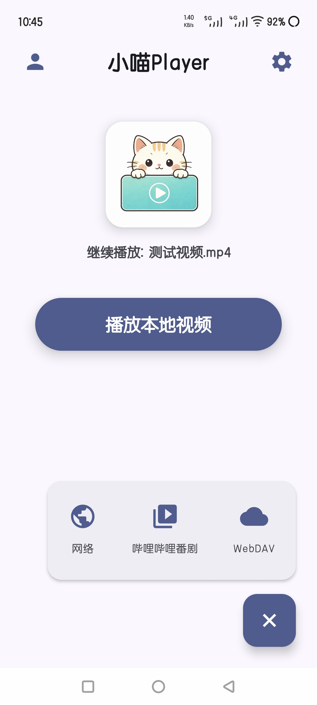 | 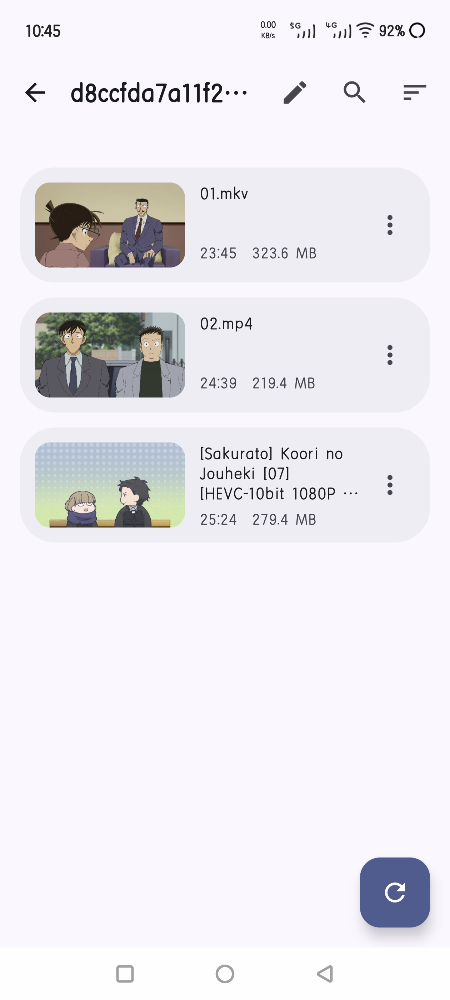 | 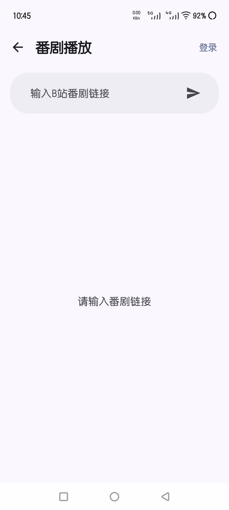 | 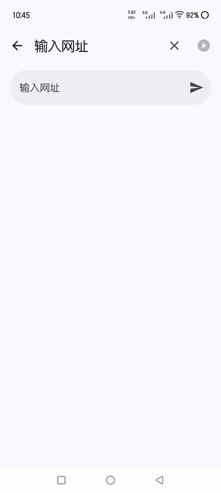 |

| WebDAV | MediaInfo | 设置 | 主题 |
|--------|-----------|------|------|
| 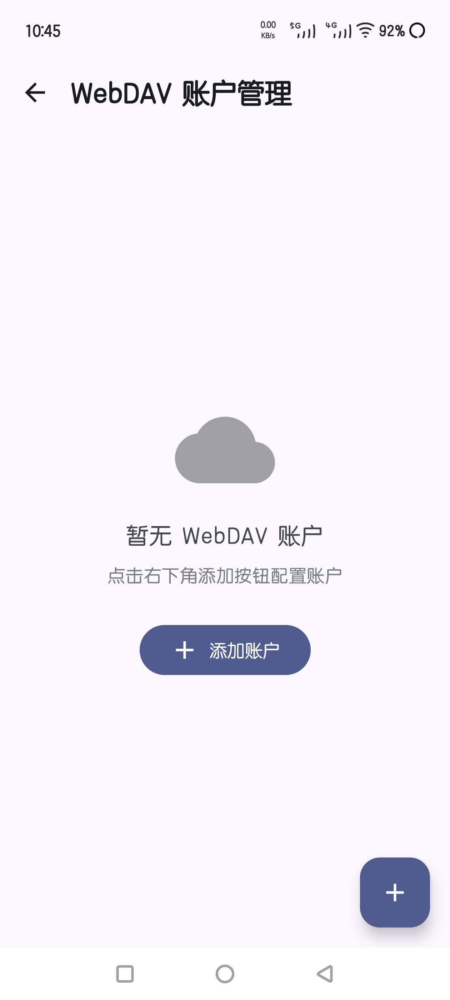 | 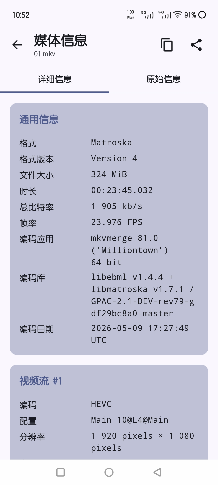 | 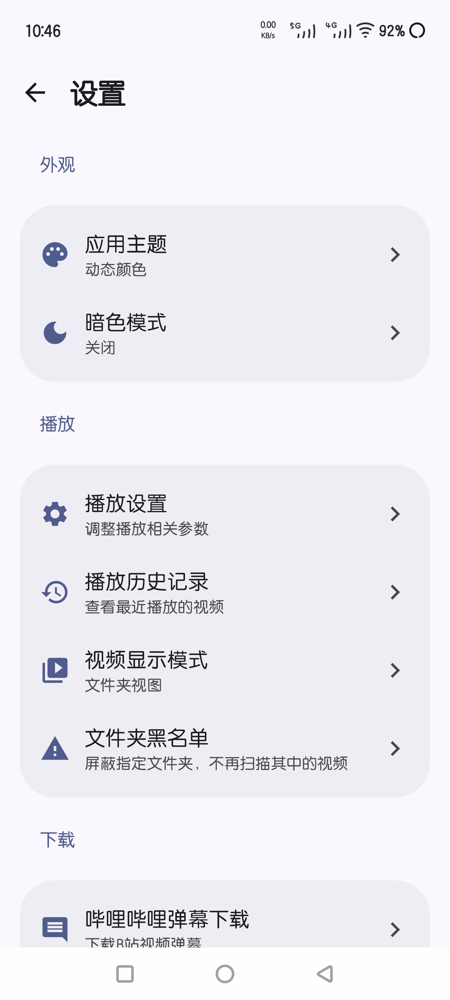 | 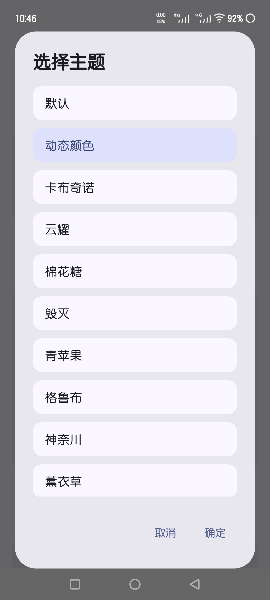 |

### 播放器界面（横屏）

| 播放主界面 | 弹幕系统 | 弹幕设置 | 手势控制 |
|------------|----------|----------|----------|
| 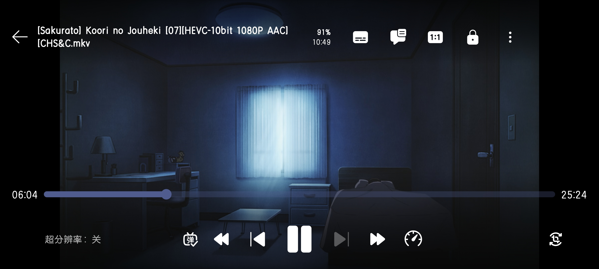 | 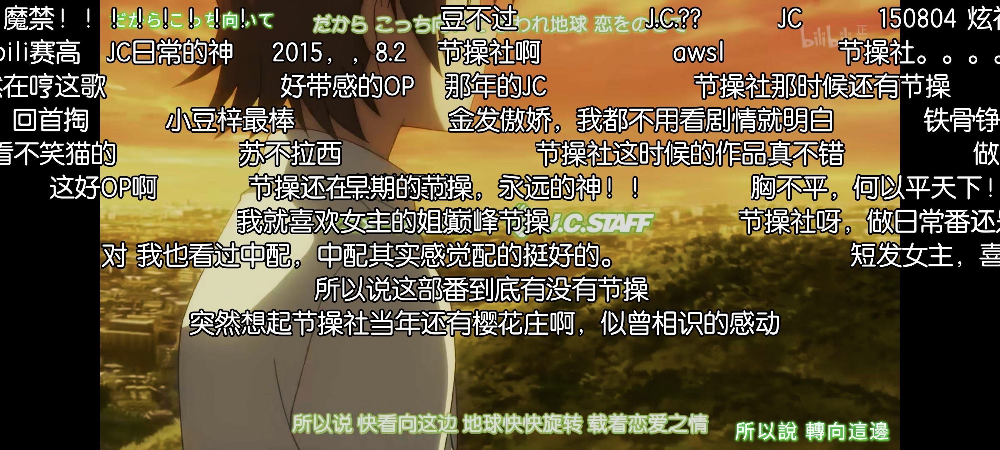 | 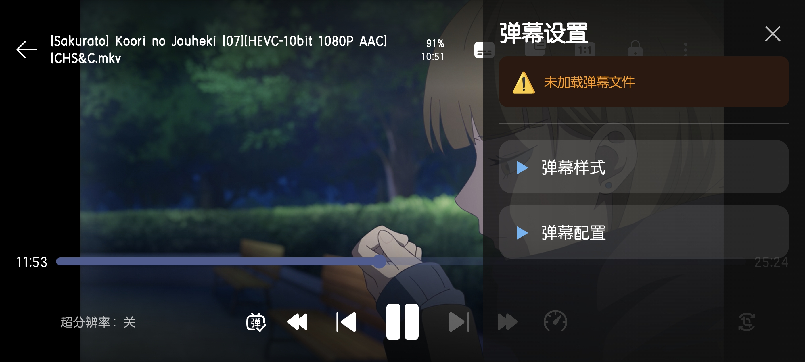 | 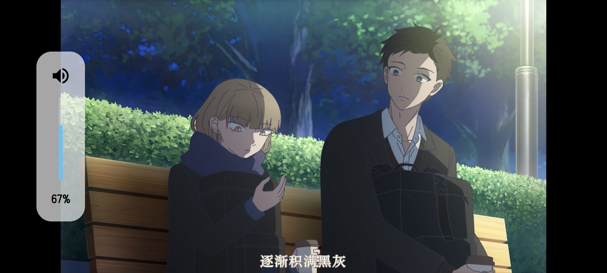 |

| 更多菜单 | 字幕设置 | 记忆播放 | 超分功能 |
|----------|----------|----------|----------|
| 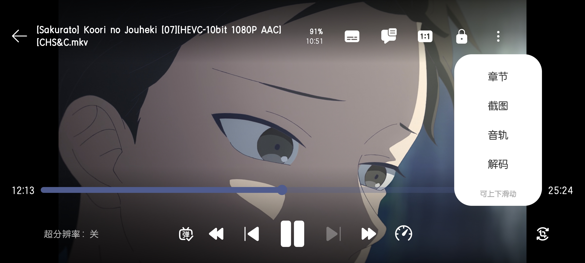 | 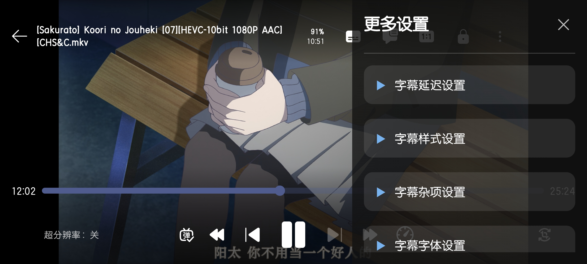 | 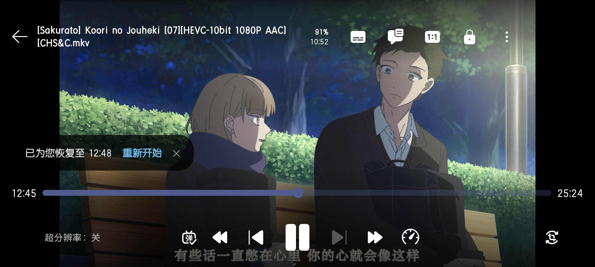 | 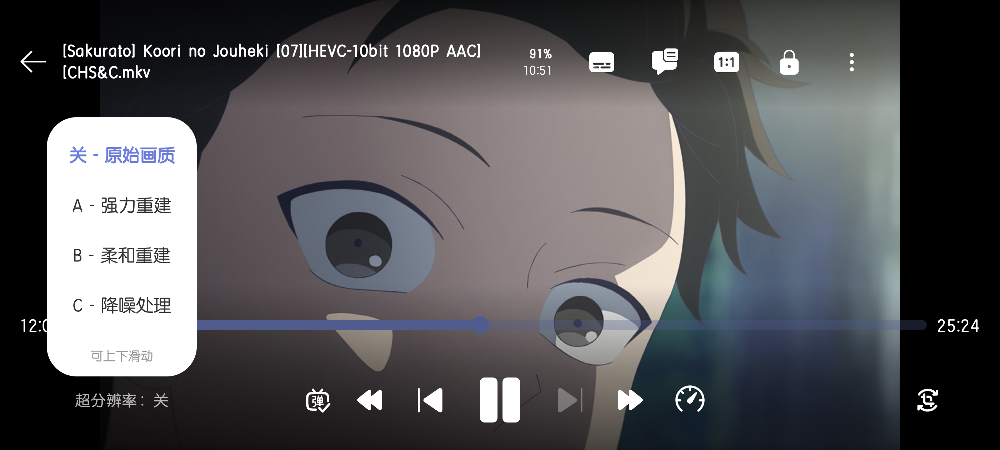 |

---

## 技术架构

基于 Manager 模式的半 MVVM 分层架构

查看完整技术架构文档：[project_architecture.md](docs/project_architecture.md)

## 致谢

本项目的诞生离不开以下开源项目和开发者的贡献，特此致谢！

### 核心基础

以下项目为本应用提供了核心技术支撑：

- **[mpv-player/mpv](https://github.com/mpv-player/mpv)**  
  本项目的核心基础，强大的开源多媒体播放器库

- **[mpv-android/mpv-android](https://github.com/mpv-android/mpv-android)**  
  Android 平台移植参考

- **[abdallahmehiz/mpv-android](https://github.com/abdallahmehiz/mpv-android/releases)**  
  提供现成可用的 libmpv 预编译库文件

- **[bilibili/DanmakuFlameMaster](https://github.com/bilibili/DanmakuFlameMaster)**  
  B站开源的 Android 弹幕引擎，本项目弹幕功能的核心

### 算法与功能实现

以下项目为本应用的功能实现提供了重要参考：

- **[bloc97/Anime4K](https://github.com/bloc97/Anime4K)**  
  实时超分辨率算法，提供 GLSL 着色器文件

- **[marlboro-advance/mpvEx](https://github.com/marlboro-advance/mpvEx)**  
  参考了滑动算法及其他功能

- **[abdallahmehiz/mpvKt](https://github.com/abdallahmehiz/mpvKt)**  
  参考了手势控制、外部字幕导入等实现

- **[xyoye/DanDanPlayForAndroid](https://github.com/xyoye/DanDanPlayForAndroid)**  
  参考了弹幕系统架构、WebDAV 功能实现及其他诸多功能

- **[the1812/Bilibili-Evolved](https://github.com/the1812/Bilibili-Evolved)**  
  参考了弹幕下载的并发优化策略和 API 调用方式

- **[btjawa/BiliTools](https://github.com/btjawa/BiliTools)**  
  参考了 B站视频/番剧下载的实现原理

- **[qiusunshine/hikerView](https://github.com/qiusunshine/hikerView)**  
  参考了网页视频嗅探功能及反嗅探算法逻辑

### API 服务与文档

感谢以下项目提供 API 服务和技术文档：

- **[弹弹play/DanDanPlay](https://www.dandanplay.com/)**  
  提供弹幕匹配 API 服务，支持本地视频智能匹配和弹幕下载

- **[wyziedevs/wyzie-subs](https://github.com/wyziedevs/wyzie-subs)**  
  提供字幕搜索 API 服务，支持在线搜索和下载影视作品字幕文件

- **[SocialSisterYi/bilibili-API-collect](https://github.com/SocialSisterYi/bilibili-API-collect)**  
  收集整理了 B站公开 API，为本项目提供了宝贵的 API 参考文档

### 灵感来源

- **[Predidit/Kazumi](https://github.com/Predidit/Kazumi)**  
  项目的最初灵感和需求来源

### 素材资源

- **应用图标**：由 AI 生成
- **播放器控制图标**：来自 [Fluent UI System Icons](https://github.com/microsoft/fluentui-system-icons)
- **其他 UI 图标**：Material Icons（Google 提供，遵循 Apache License 2.0）

---

**特别感谢以上所有开源项目和开发者的无私贡献！** 没有以上项目的开源就没有这个项目的诞生。

---

## 隐私与第三方服务

### 隐私说明

- 不收集任何个人信息
- 不上传任何数据到服务器
- 所有功能在本地设备运行
- 项目完全开源，代码可审查

### 第三方API

使用哔哩哔哩和弹弹play的公开API服务，用于番剧播放和弹幕匹配功能。

详细API列表：[第三方API使用说明](docs/third_party_api.md)

### 数据安全

登录凭证采用 AES-256 加密存储在本地设备，不上传到任何服务器。

详细安全说明：[数据安全文档](docs/data_security.md)

### 权限说明

应用请求以下权限：

- 存储权限（管理所有文件）：读取和保存本地视频、字幕、弹幕文件
- 网络权限：B站番剧在线播放、弹幕下载、视频下载（用户主动触发）

---

## 技术文档

- **[项目架构与技术栈](docs/project_architecture.md)** - 项目架构与技术栈说明
- **[项目构建引导](docs/development_guide.md)** - 项目构建和 DanDanPlay API 配置教程
- **[.nomedia 支持说明](docs/nomedia_support.md)** - .nomedia 文件处理机制
- **[WebDAV 使用说明](docs/webdav使用说明.md)** - WebDAV 配置和使用教程
- **[第三方 API 使用说明](docs/third_party_api.md)** - 使用的第三方API详细列表
- **[数据安全文档](docs/data_security.md)** - 数据加密和安全机制说明
- **[B站登录机制](docs/bilibili_login.md)** - B站登录流程和实现原理
- **[B站番剧解析](docs/bilibili_bangumi.md)** - 番剧解析和播放实现
- **[B站弹幕下载](docs/bilibili_danmaku_download.md)** - 弹幕下载算法和优化策略
- **[B站下载原理](docs/bilibili_download_principle.md)** - 视频/番剧下载实现原理
- **[B站安全分析](docs/bilibili_security_analysis.md)** - 反爬虫和安全机制分析

---

## 反馈与建议

遇到问题或有改进建议？欢迎通过以下方式反馈：

- **功能建议与反馈**：[提交 Issue](https://github.com/azxcvn/mpv-android-anime4k/issues)
- **联系作者**：[GitHub Profile](https://github.com/azxcvn)

---

**Last Updated:** 2026-05-22
